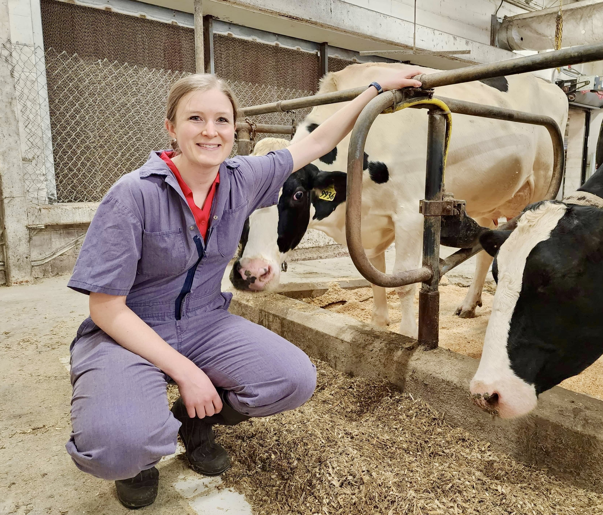

About
-----
MaryGrace Erickson is a postdoctoral associate at the University of Minnesota. Building on a background in applied dairy nutrition, she is committed to developing pathways for environmentally and socially-sustainable livestock systems. Her recent work focused on nutritional management of environmental impacts, laboratory methods for estimating emissions from stored manure, and whole-farm assessments to document sustainability transitions.

Education
-----
- Ph.D., Dairy Science, University of Wisconsin--Madison, 2023
- M.S., Animal Sciences, Purdue University, 2019
- P.A.S., Dairy Science, American Registry of Professional Animal Scientists, 2017
- B.S., Animal Sciences, Purdue University, 2017

Connect with me!
-----
I would love to hear from you. Please see the sidebar for a few ways to keep in touch. 

