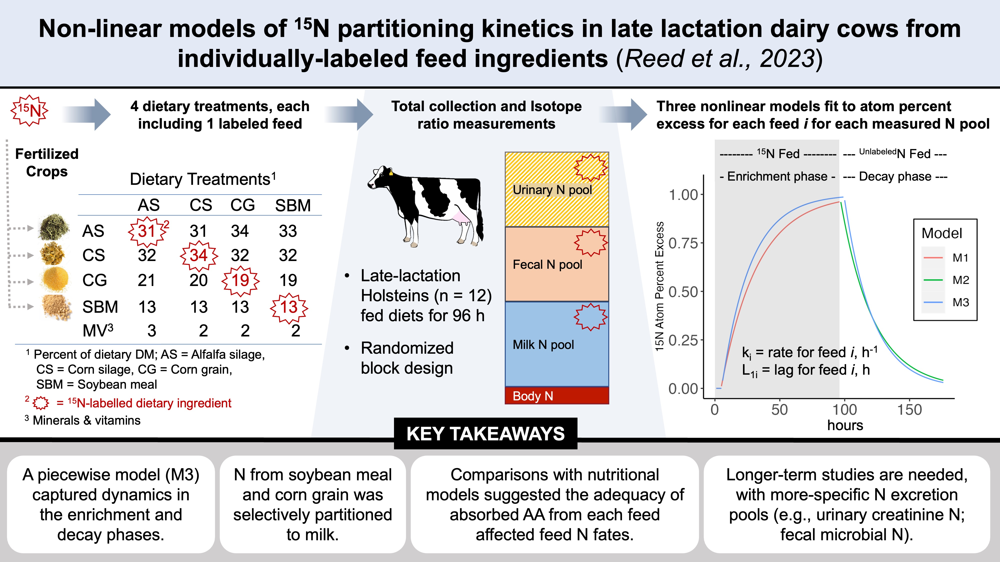
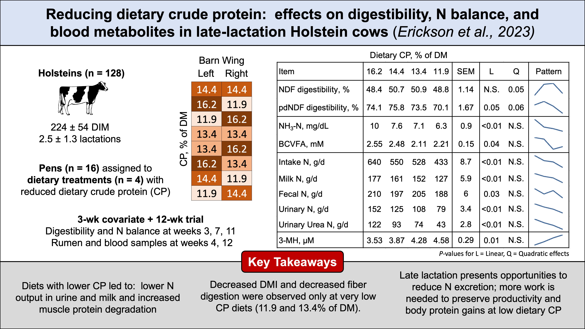
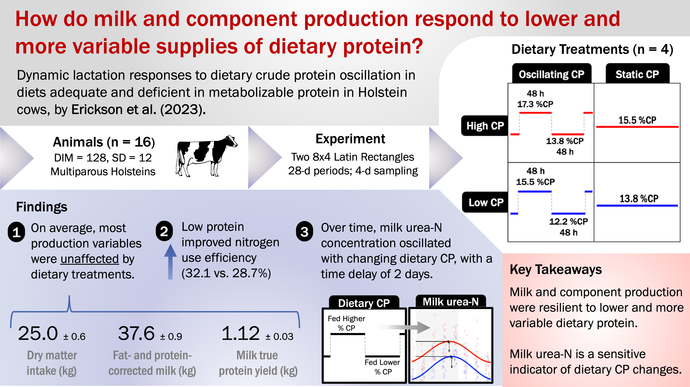

---
## Pre-prints
{: reversed="reversed"}

## Journal Articles

0. Erickson, M., Cortus, E., Koelsch, R., Johnson, L., Wilson, M. L., Andersen, D., Zelt, M., & Schmidt, A. M. (2025). Manure use benefits and barriers according to agricultural stakeholders. Agronomy Journal, 117(4), e70110. https://doi.org/10.1002/agj2.70110

2. Viquez, F., **Erickson, M.G.,** Suen, G., Zanton, G.I., and M.A. Wattiaux (2025). Assessing the impact of oscillating dietary crude protein on the stability of the rumen microbiome in dairy cattle. Frontiers in Microbiology.

1. Reed, K.F., **Erickson, M.G.**, Barros, T., Danes, M. A. C., Powell, J. M., Zanton, G. I., & Wattiaux, M. A. (2024). Nonlinear models of 15N partitioning kinetics in late-lactation dairy cows from individually labeled feed ingredients. Journal of Dairy Science, 107(11), 9176–9196. https://doi.org/10.3168/jds.2023-24239

0. **Erickson, M.G.,** Barros, T., Aguerre, M.A., Olmos Colmenero, J.J., Bertics, S.J., and M.A. Wattiaux (2025). Effects of reduced dietary crude protein concentration on digestibility, N balance, and blood metabolites in late-lactation dairy cows. Journal of Dairy Science.

0. **Erickson, M.G.,** Reinhardt, L. A., Svaren, L., Sullivan, M. L., Zanton, G. I., & Wattiaux, M. A. (2024). Crude protein oscillation in diets adequate and deficient in metabolizable protein: Effects on nutrient digestibility, nitrogen balance, plasma amino acids, and greenhouse gas emissions. Journal of Dairy Science, 107(6), 3558–3572. https://doi.org/10.3168/jds.2023-24150

0. **Erickson, M.G.,** Zanton, G.I., and M.A. Wattiaux (2023). Dynamic lactation responses to dietary crude protein oscillation in diets adequate and deficient in metabolizable protein in Holstein cows. Journal of Dairy Science. 106(12):8774-8786. <a href = "https://doi.org/10.3168/jds.2023-23603"> <i class="fas fa-link"></i></a> 

0. De los Santos, J.A., **Erickson, M.G.**, Wattiaux, M.A., and J.J. Parrish. (2023). Retrospective ratings of learning across pre-pandemic, emergency-remote, and post-pandemic instruction in an introductory biology laboratory. NACTA Journal.  67(1):323-329. <a href = "https://doi.org/10.56103/nactaj.v67i1.123"> <i class="fas fa-link"></i></a>  

0. **Erickson, M.G.,** & Wattiaux, M.A. (2022). Case study:  introductory student onboarding with a place-based, blended welcome tour. NACTA Journal. <a href="https://www.researchgate.net/publication/362850929_Case_Study_Introductory_Student_Onboarding_With_a_Place-Based_Blended_Welcome_Tour"><i class="fas fa-link"></i></a>  

0. Simmermeyer, E., **Erickson, M.G.,**  Walsh, S., & Karcher, E.L. (2022; in press). Associating synchronous and asynchronous remote teaching formats with situational interest and motivation. NACTA Journal. <a href="https://www.researchgate.net/publication/362851020_Associating_Synchronous_and_Asynchronous_Remote_Teaching_Formats_with_Student_Situational_Interest_and_Motivation"><i class="fas fa-link"></i></a>  

0. **Erickson, M.G.**  & M.A. Wattiaux. (2021). Practices and perceptions at the COVID-19 transition in animal sciences courses. Natural Sciences Education 2021;1-18.
<a href="https://doi.org/10.1002/nse2.20039"><i class="fas fa-link"></i></a>  

0. **Erickson, M.G.,** Wattiaux, M. A., Marks, D., & Karcher, E. L. (2021). Brief, written reflections improve interest of introductory animal science undergraduates. CBE—Life Sciences Education, 20(2), ar28. <a href="https://doi.org/10.1002/nse2.20039"><i class="fas fa-link"></i></a>  

0. **Erickson, M.G.,** Wattiaux, M.A., & Karcher, E.L. (2020). Longitudinal measurement invariance and stability of individual interest across a 16‐week introductory animal sciences course. Natural Sciences Education, 49(1), e20031.  <a href="https://doi.org/10.1002/nse2.20031"><i class="fas fa-link"></i></a>

0. **Erickson, M.G.,**  Ranathunga, S.D., & Wattiaux, M.A. (2020). Animal sciences undergraduate education since the ASAS centennial: a national survey and scoping review. Translational animal science, 4(4), txaa202.   <a href="https://doi.org/10.1093/tas/txaa202"><i class="fas fa-link"></i></a>

0. **Erickson, M.G.,**  Guberman, D., & Karcher, E.L. (2020) Undergraduates’ experiences of transculturation toward engaged pedagogy through a partnership program in animal sciences. NACTA Journal. <a href="https://www.researchgate.net/publication/344890529_Undergraduates'_experiences_of_transculturation_toward_engaged_pedagogy_through_a_partnership_program_in_animal_sciences"> <i class="fas fa-link"></i></a> 

0. **Erickson, M.G.,**  Grant, J.L., & Karcher, E.L. (2020). Structured support advances Extension educator intercultural development during a short-term study-abroad experience. Journal of Extension.  <a href="https://tigerprints.clemson.edu/joe/vol58/iss4/12/"> <i class="fas fa-link"></i></a>

0. **Erickson, M.G.,**  Marks, D., & Karcher, E. (2020). Characterizing student engagement with hands-on, problem-based, and lecture activities in an introductory college course. Teaching & Learning Inquiry, 8(1), 138–153.  <a href="https://doi.org/10.20343/teachlearninqu.8.1.10"> <i class="fas fa-link"></i></a>

0. Malacco, V.M., Laguna, J.G., **Erickson, M.G.,** Smith, E., & Donkin, S.S. (2020) Short communication:  in search of an optimal dose for glucose tolerance tests in lactating dairy cattle. Journal of Dairy Science.  <a href="https://pubmed.ncbi.nlm.nih.gov/32475657/"> <i class="fas fa-link"></i></a>

0. **Erickson, M.G.,**  Knobloch, N.A., Karcher, D.M., Erasmus, M., & Karcher, E.L. (2020). High school students’ STEM motivation before and after online modules contextualizing STEM in poultry science. Journal of Agricultural Education.  <a href="https://www.researchgate.net/publication/343724993_High_School_Student_and_Teacher_Perceptions_of_an_Online_Learning_Experience_Integrating_STEM_and_Poultry_Science"> <i class="fas fa-link"></i></a> 

0. **Erickson, M.G.,** Knobloch, N.A., Karcher, D.M., Erasmus, M., & Karcher, E.L. (2019). Poultry in the classroom:  Effectiveness of an online education program designed to increase high school students’ interest in poultry science. Poultry Science. <a href="https://www.researchgate.net/publication/335468264_Poultry_in_the_classroom_effectiveness_of_an_online_poultry-science-based_education_program_for_high_school_STEM_instruction"> <i class="fas fa-link"></i></a>   

0. **Erickson, M.G.,**  Karcher, E.L., & Guberman, D. (2019). Interest and active learning techniques in an introductory animal sciences course. North American College Teachers of Agriculture Journal. <a href="https://www.researchgate.net/publication/343376853_Interest_and_Active_Learning_Techniques_in_an_Introductory_Animal_Science_Course
"> <i class="fas fa-link"></i></a>  

2. Worden, L., **Erickson, M.G.,** Gramer, S., Tap, C., Ylioja, C., Trottier, N., Preseault, C.L, VandeHaar, M.J., Lock, A.L., & Karcher, E. (2018). Short communication: Decreasing the dietary ratio of n-6 to n-3 fatty acids increases the n-3 concentration of peripheral blood mononuclear cells in weaned Holstein heifer calves. Journal of Dairy Science, 101(2), 1227-1233.  <a href="https://pubmed.ncbi.nlm.nih.gov/29174150/"> <i class="fas fa-link"></i></a> 
{: reversed="reversed"}
