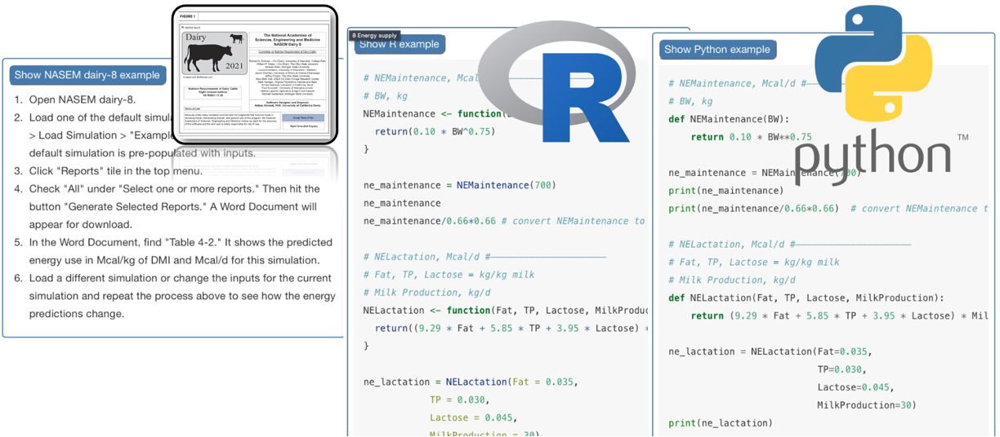

Learning from NASEM (2021) - Decoding Dairy Diets 
-----
In 2023, I created an  online interactive  textbook  introducing  nutritional  and  environmental  modeling  in  R  and  Python based  on  NASEM  (2021).   A  pilot  version  was  shared  at  ADSA 2023:  [Decoding Dairy Diets](https://merickson3.github.io/NASEM_pilot/).  

dairynasem R package
-----

I developed an R package to run the NASEM (2021) model on batched inputs. 

[Github repository for dairynasem](https://github.com/merickson3/dairynasem/tree/main)

