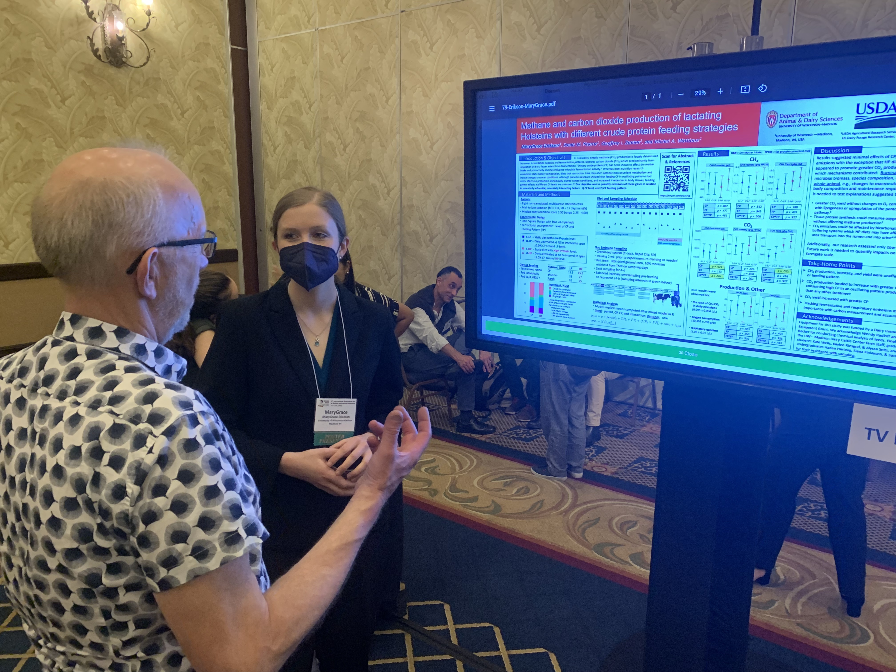

0. **Erickson, M.G.**, Zanton, G.I., and M.A. Wattiaux. (2023, July 5). \marginnote{\begin{small} \textcolor{FireBrick}{Featured Presentations}\end{small}} Invited talk:  Dietary crude protein oscillation in diets adequate and deficient in metabolizable protein. US Dairy Forage Webinar Series. 

0. Wattiaux, M.A., Pizarro, D., **Erickson, M.G.**, and C.A. Gomez. Using The Sustainable Development Goals to Guide Research in Agricultural and Food Systems. (2023, May 31-June 3). VII Wallace Conference. Costa Rica. CATIE, Turrialba, Costa Rica.

0. Pizarro, D., **Erickson, M.G.**, D. Lucantoni, A. Mottet, C.A. Gomez, and M.A. Wattiaux. Some smallholders in Peru keep more trees on the farm than others--what else is going on? (2023, April 25). College of Agricultural and Life Sciences Global Day, Madison, WI, USA.

0. Pizarro, D., **Erickson, M.G.**, D. Lucantoni, A. Mottet, and M.A. Wattiaux. Agroecological transition and holistic sustainability of smallholder dairy cattle systems. (2023, June 4-8). International Symposium on the Nutrition of Herbivores in Florianopolis, Brazil. 

0. **Erickson, M.G.**, Zanton, G.I., and M.A. Wattiaux. (2023, June 27). Effects of level and oscillation of dietary crude protein on ruminal conditions. Poster at the American Dairy Science Association Annual Meeting in Ottawa, Ontario, Canada. 

0. **Erickson, M.G.**, Hanigan, M.D., and Wattiaux, M.A. (2023, June). Invited Symposium Talk:  Teaching with the narrative and model in NASEM (2021) "Nutrient Requirements of Dairy Cattle." Presentation at the American Dairy Science Association Annual Meeting in Ottawa, Ontario, Canada. J. Dairy Sci. 106(Suppl. 1), 43. 

0. Ronk, E., **Erickson, M.G.**, and Wattiaux, M.A. (2023, June). Emerging topics and pedagogies in animal and dairy science:  a survey of student preferences. Presentation at North American College Teachers of Agriculture Annual Meeting in Las Cruces, NM. 

0. Ronk, E., **Erickson, M.G.**, and Wattiaux, M.A. (2023, May 18). Accounting for changing student preferences in animal and dairy science curriculum and pedagogy. Presentation at University of Wisconsin--Madison Teaching Symposium. 

0. Pizarro, D.M., **Erickson, M.G.**, Gomez, C., and Wattiaux, M.A. (2022, Oct. 26). Measuring Agroecological Performance of Dairy Cattle Systems in the Peruvian Amazon. University of Wisconsin--Madison Sustainability Symposium. 

0. Erickson, M.G., Zanton, G.I., and M.A. Wattiaux. (2022, June 22). Effects of dietary crude protein level and feeding pattern on production, nutrient digestion and excretion. Poster presented at American Dairy Science Association Annual Meeting in Kansas City, MO. 

0. Erickson, M.G., Zanton, G.I., and M.A. Wattiaux. (2022, June 21). Effects of dietary crude protein level and feeding pattern on milk production. Lecture presented at American Dairy Science Association Annual Meeting in Kansas City, MO. 

0. Erickson, M.G. and M.A. Wattiaux. (2022, June 21). Teaching Symposium Talk:  Educational psychology methods to advance teaching scholarship and improve student learning in dairy science. Lecture presented at American Dairy Science Association Annual Meeting in Kansas City, MO. 

0. Erickson, M.G., Pizarro, D.P., Zanton, G.I., and M.A. Wattiaux. (2022, June 6). Methane and carbon dioxide production of lactating Holsteins cows with different crude protein feeding strategies. Poster presented at Greenhouse Gas & Animal Agriculture Annual Meeting in Orlando, FL. <a href="merickson3.github.io/files/S22-GGAA-Poster-D04.pdf"><i class="fas fa-link"></i></a>  

0. Simmermeyer, E., M.G. Erickson, & E.L. Karcher. (2021, June 14). Situational interest and intrinsic motivation in various remote teaching formats. Lecture presented at North American College Teachers of Agriculture virtual Annual Meeting.

0. Wattiaux, M.A., Erickson, M.G., & Pizarro, D. (2021, July 12). Discussion-based strategies for remote teaching and learning. Workshop presented at the American Dairy Science Association virtual Annual Meeting. 

0. Erickson, M.G., Schroeder, L., Zoerb, H., & Wattiaux, M.A. (2021, June 14). Concept-testing a dairy innovation challenge for university students and dairy industry mentors. Poster presented at North American College Teachers of Agriculture virtual Annual Meeting. 

0. Erickson, M.G., Wickenhauser, J.L., Simmermeyer, E., Wattiaux, M.A., & Karcher, E.L. (2021, June 14). Making science reading motivating: comparing post-reading support activities. Lecture presented at North American College Teachers of Agriculture virtual Annual Meeting. 

0. Erickson, M.G., Marks, D., Karcher, E.L., & Wattiaux, M.A. (2020, July 19). Validating adapted scales to measure interest in animal science. Poster presented at American Society of Animal Science Annual Meeting. 

0. Erickson, M.G., Marks, D., Karcher, E.L., & Wattiaux, M.A. (2020, June 16). Brief written reflections improve interest of introductory animal science students:  a randomized controlled intervention study. Lecture presented at North American College Teachers of Agriculture virtual Annual Meeting. 

0. Erickson, M.G., Knobloch, N.A., Karcher, D.M., Erasmus, M., Karcher, E.L. (2019, June 19). Poultry in the Classroom:  effectiveness of an online poultry-science-based education program for high school STEM instruction. Lecture presented at the Poultry Science Association Annual Meeting in Montreal, Quebec.

0. Erickson, M. G., Karcher, E. L. (2019, June 19). Motivational effects of hands-on, problem-based, and lecture activities in an introductory college course. Lecture presented at North American College Teachers of Agriculture in Twin Falls, ID.

0. Erickson, M. G., Karcher, E. L., Zhu, H., & Guberman, D. (2019, June 19). Poultry in the Classroom:  effectiveness of an online poultry-science-based education program for high school STEM instruction. Lecture presented at North American College Teachers of Agriculture in Twin Falls, ID.

0. Erickson, M. G., Karcher, E. L., & Guberman, D. (2018, October 25). Partnering faculty with undergraduate teaching assistants in an introductory animal science course. Lecture presented at International Society for the Scholarship of Teaching and Learning in Bergen, Norway.

0. Erickson, M. G. (2018, October 12). Dairy Goat Health and Husbandry. Lecture presented at Ivy Tech Community College Introduction to Animal Sciences in Richmond, IN.

0. Erickson, M. G., Karcher, E. L., Zhu, H., & Guberman, D. (2018, June 14). Active Learning Strategies Impact Curiosity in an Introductory Animal Sciences Course. Lecture presented at North American College Teachers of Agriculture in Ames, IA.

0. Erickson, M. G., Donkin, S.S. (2017, April 13). In Search of an Optimal Glucose Tolerance Testing Protocol for Assessing Glucose Kinetics and Metabolic Status in Dairy Cows. Lecture presented at Tri-State Dairy Nutrition Conference in Fort Wayne, IN.

0. Erickson MG, Baker S, Vezzoli G, Hester P, Makagon M. Effect of perch material on perch use, hen welfare and egg production. Poultry Science Association Annual Meeting Proceedings; 2015 July 27-30; Louisville, KY. Dept. Animal Sciences, Purdue University, West Lafayette, IN. 
{: reversed="reversed"}

