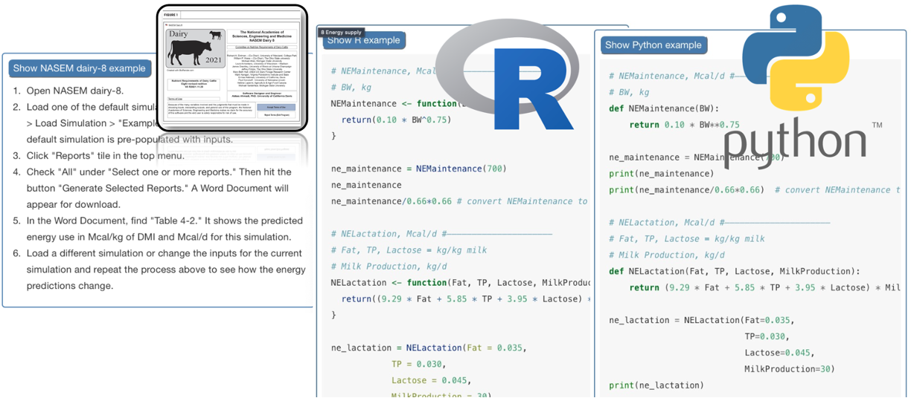

Learning from NASEM (2021) - Decoding Dairy Diets 
-----
In 2023, I created an  online interactive  textbook  introducing  nutritional  and  environmental  modeling  in  R  and  Python based  on  NASEM  (2021).   A  pilot  version  was  shared  at  ADSA 2023:  [Decoding Dairy Diets](https://merickson3.github.io/NASEM_pilot/).  

A teaching philosophy I wrote in early 2022
-----
My approach to excellent teaching in the natural sciences was first informed by my experience as a natural sciences learner. As an undergraduate, I experienced first-hand the power that “research-1” universities can have by teaching at science’s cutting edge. However, I also noticed opportunities for improvement. First, although over 70% of my graduating class identified as female, I did not have a female science instructor until my senior year. Second, I was not a “Type A” learner, and I felt the grading structures punished the neurodiverse, rather than guiding and motivating learning. Yet it excited me that natural science education, much like science itself, is always improving itself.

When I began my teaching assistantship at UW—Madison, I was refreshed to find a community who shared a similar goal as I do: I want to teach in a way that invites participation, welcomes diversity, and illustrates science as dynamic and socially-embedded. As a humanist, I believe that people have a natural tendency to self-actualize and seek meaningful learning. When learners’ motivation is lacking, this is often the result of cultural, structural, or contextual barriers to engagement. As a cognitive constructivist, part of my teaching practice involves identifying and overcoming conceptual hurdles and interleaving natural sciences habits of thinking into existing cognitive schema. In practice, I maintain high expectations for students, communicate learning outcomes clearly, offer low-stakes assessments with volumes of personalized feedback and support, and open multiple modes of student-to-teacher communication/listening.

As I have matured as a scholar, my engagement in discipline-based educational research has become a wellspring of inspiration for my teaching practice. I am first and foremost a scientist—I believe that excellent teaching is evidence-based teaching. My Ph.D. research prompted numerous developments. First, in qualitative responses, I noticed that beginning learners expressed achievement-limiting beliefs that science participation involved suppressing their emotions and distancing themselves personally. To work against this, I revised my course materials to reframe science as a means to deepen and discipline the senses and ultimately expand one’s consciousness of the natural world. Second, my research repeatedly showed that inviting students to reflect on the practical and personal meanings of scientific topics improved their interest in studying science, with implications on their course performance and persistence. Rather than positioning students as consumers and beneficiaries of scientific knowledge, I encouraged learners to take on the identity of scientist early and often in their coursework. Finally, I integrated activities with hands-on and tactile elements for which I documented greater cognitive, emotional, and behavioral engagement compared with abstractions.

Despite my interest in research, the aspect I find most exhilarating about working with natural science learners is their inherent unpredictability—their wild and emerging potential. Spending the semester with several-hundred such students at UW—Madison has been the absolute privilege of my life! With strong background coursework, the natural world and scientific community are open to them.

